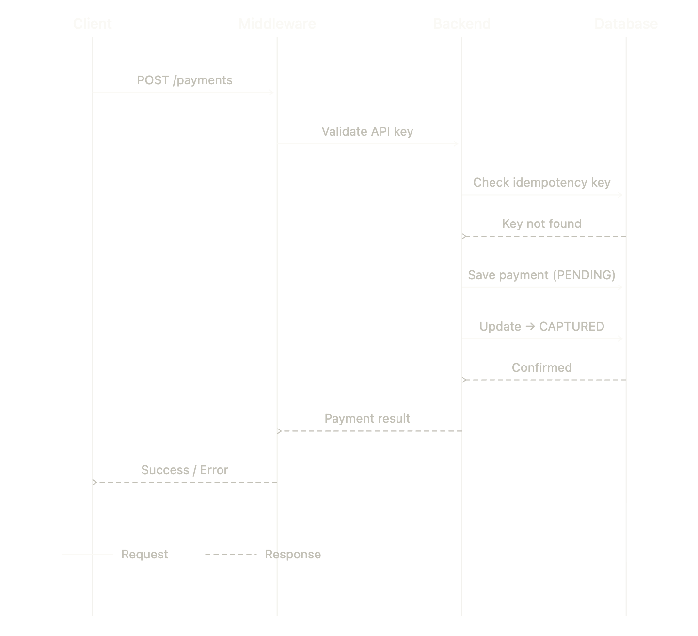

# SandPay

A sandbox payment gateway built with Node.js, TypeScript, React, and PostgreSQL. Simulates real-world payment processing including authorization, capture, refunds, and idempotency — without wrapping a third-party API.

## Why I Built This

I wanted to see what really happens when you click "Pay," not just as a user but as a developer. Most tutorials just show how to add Stripe or another SDK and move on, but I wanted to understand the details. I wanted to know how payments actually change state, how the system keeps its records accurate, and how it handles duplicate requests safely.

I built it as a sandbox on purpose. Dealing with real payments means dealing with banks, regulators, and APIs that can take months or years to get access to. A sandbox lets me focus on the engineering side of things, like how state changes, how accounting works, and how to prevent errors, without those hurdles. Those are the problems that are actually interesting to solve.

## Features

### Backend:

- Payment lifecycle: Payments move through stages like pending, captured, refunded, or failed.
- Refunds: You can do full or partial refunds, but only on payments that have been captured.
- Idempotency keys: Duplicate requests are safely rejected using Redis.
- API key authentication: A simple middleware protects all routes.
- Double-entry ledger: Every transaction creates two journal entries to keep the books correct.

## Tech Stack

- Frontend: React.js, TypeScript,
- Backend: Node.js, Express, TypeScript
- Database: PostgreSQL

